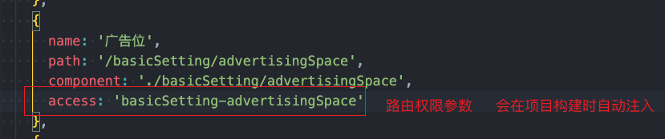

# umi-plugin-access-code

> 美萌后台权限插件---根据后台路由生成权限code

通过此插件可以实现：

+ 命令式生成路由权限code
+ 自动注入路由权限: 给`confg/route`目录中的路由配置自动绑定 access权限code
+ 支持绑定操作权限code

## 安装依赖

```bash
// 将插件安装至project_name中
$ pnpm add umi-plugin-access-code --registry=http://47.103.40.50:3200  --filter project_name
```

## 使用

### 配置插件

在后台项目中的 `config/config.ts`中写入配置

```js
export default {
  // ...其他配置
  accessCodes: {
    routeInject: REACT_APP_ENV !== 'dev',
    sql: true,
    exclude: ['home', 'login', 'user-setting', 'user-notices']
  },
}
```

### package.json中配置脚本命令

```json
 {
    "scripts": {
      "code": "umi accessCode"
    },
 }
```

### 生成code

运行命令： `pnpm run code` 生成code

```bash

➜  backend-shop git:(shop_2.3.0) pnpm run code

> @MetaAdsManager/backend-shop@2.2.2 code /Users/namehu/mm-frontend/packages/backend-shop
> umi accessCode

INFO 生成accessCode成功
```

命令执行成功后会在`src/access.ts` 中新增路由权限code

```js

export const codes = [
  // CODE_START
  /**
   * 权限code
   * 以下内容均为access-code插件生成（CODE_START至CODE_END部分）
   * 所以请勿在此区域内写入内容。
   * 你可以通过运行 pnpm umi accessCode 自动生成
   */
  'basicSetting',
  'sysSetting',
  'sysSetting-employeeManagement',
  'sysSetting-roleManagement',
  'sysSetting-resourcesManagement'
  // CODE_END
] as const


```

> `// CODE_START` 与 `// CODE_END` 时插件替换起止边界符。请不要删除。如果你的项目中没有这两个。请手动补一下。

## 选项参数

### routeInject

+ 类型：`boolean`
+ 默认值：`false`

是否在路由中注入路由权限参数`access:xxx`
启用后。无需在路由上手动写入access参数。插件会在构建项目时自动注入该参数。



**建议在项目打包时注入**  => routeInject: REACT_APP_ENV !== 'dev',

### exclued

+ 类型：`string[]`
+ 默认值：`[]`

不需要生成的code。项目中会存在不需要生成code的路径。此时。你可以将这些路径对应的code加到exclued数组中。这样在权限code生成以及注入时。会被忽略。
举例来说:

路由配置文件`route.ts`

```js

  const routes =[
    { name: '登录', path: '/login', component: './login', layout: false, hideInMenu: true },
    { name: '首页', path: '/home', component: './home' }
  ]
```

配置文件`config/config.ts`

```js

{
  // 排除登录页code
   exclude: ['login']
}

// => 最终生成的code为 access = ['home']
```

> **注意** 需要填写的是权限code。而不是路径

### sql

+ 类型：`boolean`
+ 默认值：`false`

是否生成sql文件.设置为true时。会在项目根目录生成一份`accessCode.sql`文本。你可以将此文本提供给后端插入到数据库中

## 开发

```bash
// 安装依赖
$ pnpm install --filter umi-plugin-access-code

// 启动
$ cd components/umi-plugin-access-code && npm run build --watch
```

## LICENSE

MIT
