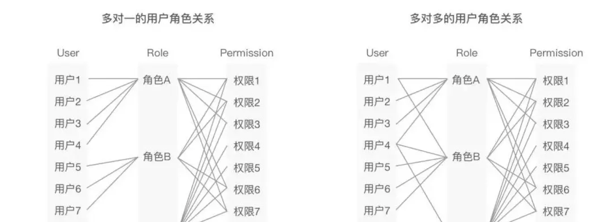
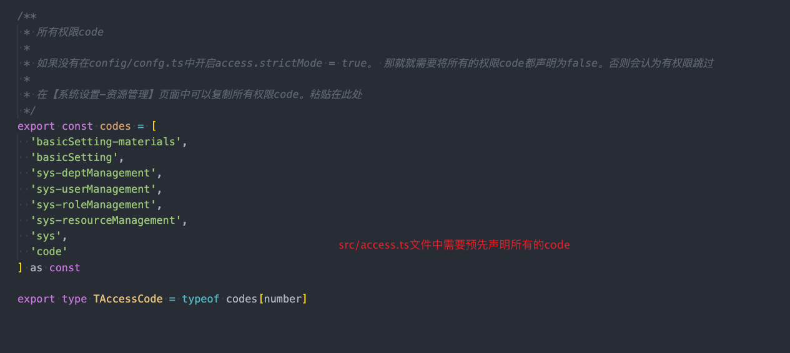

# 框架基础功能介绍

## 框架在antd pro的基础上封装了基础的业务逻辑。主要为

- 登录注册
- 权限管理        - 完整的【人员】-【角色】-【资源】的权限管理
- 用户信息管理
- 素材库          - 通用的阿里云图片、视频管理模块

### 登录注册

框架提供了开箱即用的登录注册功能。免去重复开发的工作。 对于忘记密码、注册等功能。如果不需要可以根据需要注释相关代码

### 权限管理

通用的后台管理系统都会有对应的用户权限管理。本框架的权限设计采用的典型的RBAC模型设计。即由“用户”，“角色”以及“权限”这三个主体组成，一个用户可以有多个角色，一个角色可以有多个权限，他们之间的关系可以是多对一关系，也可以是多对多关系。

在框架中我们分为了三张表进行维护

关于具体的权限配置。请自行参阅文档

### Q&A

1.为什么我配置了资源管理并正确的给路由设置了access参数。但是菜单依旧展示出来了？

当你新增了一个系统资源code之后。你需要手动的将所有的资源code同步进`src/access`文件中

